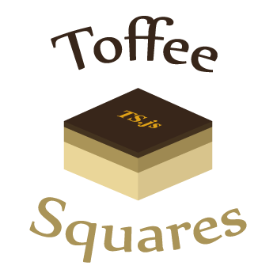

ToffeeSquares.js
================



Get quickly started to develop an awesome *Phaser* game using *TypeScript*.


Get started
-----------

First get the succulent ingredients.
```bash
npm install
bower install
```

Next, made a tasteful game using *TypeScript*. All the `.ts` go to `lib/`

Lastly, see your delicious game using `grunt` command-line.

License
-------

[CC0](https://creativecommons.org/publicdomain/zero/1.0/ "Public Domain")
